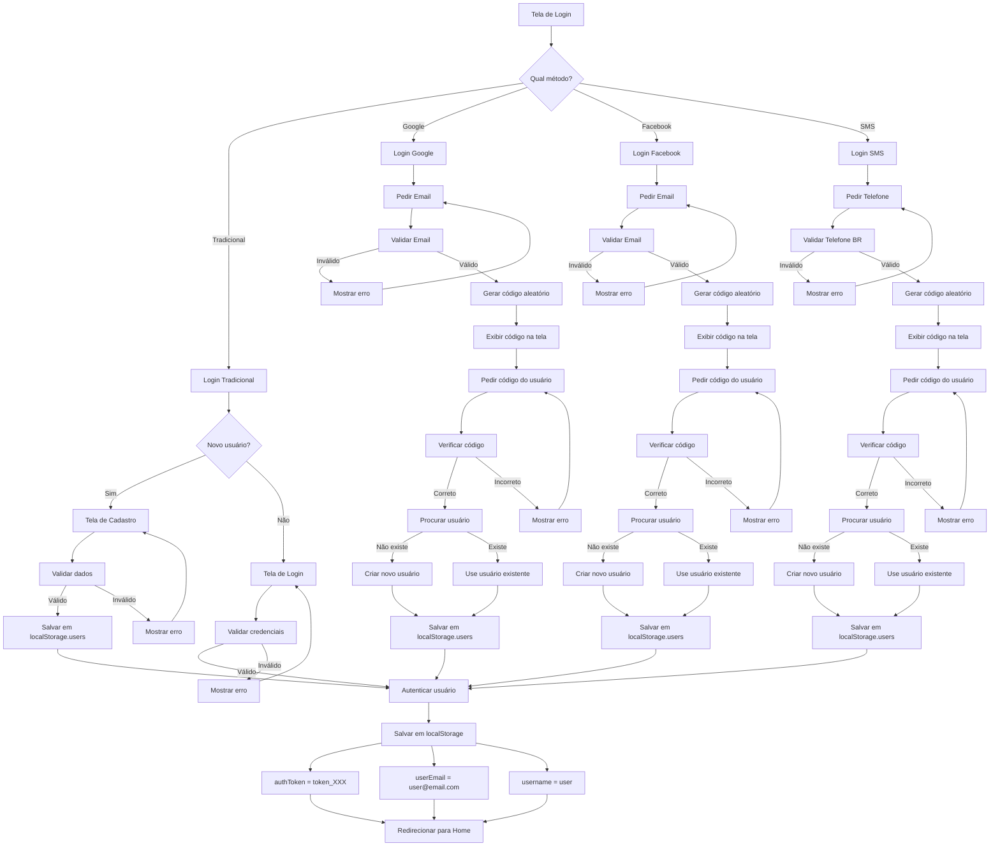

# 📊 Diagrama de Fluxo da Autenticação



---

## 🔄 Fluxo Detalhado: Login Tradicional

```
TELA INICIAL
    ↓
[Não tem conta? Crie uma] ← Click
    ↓
TELA DE CADASTRO
├─ Username: _______
├─ Email: _______
├─ Senha: _______
├─ Confirmar Senha: _______
├─ ☐ Aceitar Termos
└─ [Criar Conta]
    ↓
VALIDAÇÕES
├─ ✓ Username preenchido?
├─ ✓ Email formatado corretamente?
├─ ✓ Senha com 6+ caracteres?
├─ ✓ Confirmação bate?
├─ ✓ Termos aceitos?
└─ ✓ Email não duplicado?
    ↓
✅ TODOS OK
    ↓
Salvar em localStorage.users
    ↓
Autenticar
    ↓
[REDIRECT] → Home Page
    ↓
✅ SUCESSO
```

---

## 🔄 Fluxo Detalhado: Login Google

```
TELA INICIAL
    ↓
[Entrar com Google] ← Click
    ↓
TELA GOOGLE LOGIN
├─ Email: _______
└─ [Enviar Código]
    ↓
VALIDAÇÃO
├─ ✓ Email preenchido?
└─ ✓ Email formatado?
    ↓
✅ VÁLIDO
    ↓
code = generateRandomCode()
    ↓
EXIBIR CÓDIGO
├─ "Seu código é: 456789"
├─ "Enviado para: usuario@gmail.com"
└─ Código: [456789]
    ↓
[TELA DE VERIFICAÇÃO]
├─ Digite o código: _______
└─ [Verificar Código]
    ↓
VALIDAÇÃO
├─ ✓ Código preenchido?
└─ ✓ Código correto?
    ↓
✅ VÁLIDO
    ↓
PROCURAR USUÁRIO
├─ findUser(usuario@gmail.com)
│
└─ Encontrou? 
   ├─ SIM → Use usuário existente
   └─ NÃO → Criar novo usuário com:
      ├─ id: timestamp
      ├─ username: usuario (parte antes @)
      ├─ email: usuario@gmail.com
      ├─ loginMethod: google
      ├─ password: null
      └─ createdAt: now()
    ↓
Salvar em localStorage.users
    ↓
Autenticar usuário
    ↓
[REDIRECT] → Home Page
    ↓
✅ SUCESSO
```

---

## 🔄 Fluxo Detalhado: Login SMS

```
TELA INICIAL
    ↓
[Entrar com Telefone] ← Click
    ↓
TELA SMS LOGIN
├─ Telefone: _______
│  (Formato: (DDD) 9XXXX-XXXX)
└─ [Enviar Código]
    ↓
VALIDAÇÃO
├─ ✓ Telefone preenchido?
├─ ✓ Formato válido?
└─ ✓ Começa com 9?
    ↓
FORMATAÇÃO AUTOMÁTICA
Entrada: "51987654321"
    ↓ (auto-formata)
Saída: "(51) 98765-4321"
    ↓
✅ VÁLIDO
    ↓
code = generateRandomCode()
    ↓
EXIBIR CÓDIGO
├─ "Seu código é: 123456"
├─ "Enviado para: (51) 98765-4321"
└─ Código: [123456]
    ↓
[TELA DE VERIFICAÇÃO]
├─ Digite o código: _______
└─ [Verificar Código]
    ↓
VALIDAÇÃO
├─ ✓ Código preenchido?
└─ ✓ Código correto?
    ↓
✅ VÁLIDO
    ↓
PROCURAR USUÁRIO
├─ findUser((51) 98765-4321)
│
└─ Encontrou? 
   ├─ SIM → Use usuário existente
   └─ NÃO → Criar novo usuário com:
      ├─ id: timestamp
      ├─ username: user_51987654321
      ├─ phone: (51) 98765-4321
      ├─ email: sms_1234567890@casaemdia.local
      ├─ loginMethod: sms
      ├─ password: null
      └─ createdAt: now()
    ↓
Salvar em localStorage.users
    ↓
Autenticar usuário
    ↓
[REDIRECT] → Home Page
    ↓
✅ SUCESSO
```

---

## 💾 Estrutura de localStorage

```
localStorage
│
├─ users
│  └─ [
│     {
│       id: 1234567890,
│       username: "joao",
│       email: "joao@email.com",
│       password: "123456",
│       loginMethod: "traditional",
│       createdAt: "2026-07-02T10:30:00Z"
│     },
│     {
│       id: 1234567891,
│       username: "maria",
│       email: "maria@gmail.com",
│       password: null,
│       loginMethod: "google",
│       createdAt: "2026-07-02T10:35:00Z"
│     },
│     {
│       id: 1234567892,
│       username: "user_51987654321",
│       phone: "(51) 98765-4321",
│       email: "sms_1234567892@casaemdia.local",
│       password: null,
│       loginMethod: "sms",
│       createdAt: "2026-07-02T10:40:00Z"
│     }
│   ]
│
├─ authToken ← "token_1234567890"
│
├─ userEmail ← "joao@email.com"
│
├─ username ← "joao"
│
└─ rememberMe ← "true" (opcional)
```

---

## 🔐 Estado do Componente Login.jsx

```
Login Component State:

Traditional Mode:
├─ email: string
├─ password: string
├─ username: string
├─ confirmPassword: string
├─ isNewUser: boolean

Social Mode:
├─ authMode: 'traditional'|'google'|'facebook'|'sms'
├─ verificationCode: string
├─ sentCode: string
├─ codeWasSent: boolean
├─ phone: string
├─ socialEmail: string

General:
├─ error: string
├─ loading: boolean
├─ acceptTerms: boolean
├─ rememberMe: boolean
```

---

## 🔍 Funções Principais

```
generateRandomCode()
└─ Math.floor(100000 + Math.random() * 900000)
   └─ Retorna: "456789"

validateEmail(email)
└─ /^[^\s@]+@[^\s@]+\.[^\s@]+$/
   └─ Retorna: boolean

validatePhone(phone)
└─ /^\(?[0-9]{2}\)?[\s-]?9[0-9]{4}-?[0-9]{4}$/
   └─ Retorna: boolean

formatPhone(value)
└─ "51987654321" → "(51) 98765-4321"

getUsersFromStorage()
└─ JSON.parse(localStorage.getItem('users'))
   └─ Retorna: Array<User>

findUser(emailOrUsername)
└─ users.find(u => u.email === emailOrUsername || u.username === emailOrUsername)
   └─ Retorna: User|undefined

authenticateUser(user)
├─ localStorage.setItem('authToken', ...)
├─ localStorage.setItem('userEmail', ...)
├─ localStorage.setItem('username', ...)
└─ window.location.href = '/'
```

---

## 🎯 Decisões de Design

### Por que localStorage?
- ✅ Simples para prototipagem
- ✅ Persiste entre sessões
- ✅ Sincroniza entre abas
- ❌ Não é seguro para produção
- ❌ Limite de 5-10MB

### Por que código aleatório?
- ✅ Simula SMS/Email real
- ✅ Código exibido para teste
- ✅ 6 dígitos é padrão industry

### Por que FormattedPhone?
- ✅ Melhora UX
- ✅ Reduz erros de input
- ✅ Compatível com browsers

### Por que cada método cria usuário?
- ✅ Simplifica primeiro acesso
- ✅ Não precisa cadastro prévio
- ✅ UX mais ágil

---

## ⚠️ Limitações & TODOs

### Atual (Prototipagem)
```
✅ Login Local Storage
✅ Múltiplos métodos
✅ Validações básicas
✅ Código aleatório
✅ Formato telefone
```

### Produção
```
❌ Backend real
❌ JWT tokens
❌ API Google OAuth
❌ API Facebook SDK
❌ SMS real (Twilio)
❌ Hash de senhas
❌ HTTPS obrigatório
❌ Rate limiting
❌ 2FA
❌ Auditoria
```

---

**Diagrama atualizado: 02/07/2026** ✅
